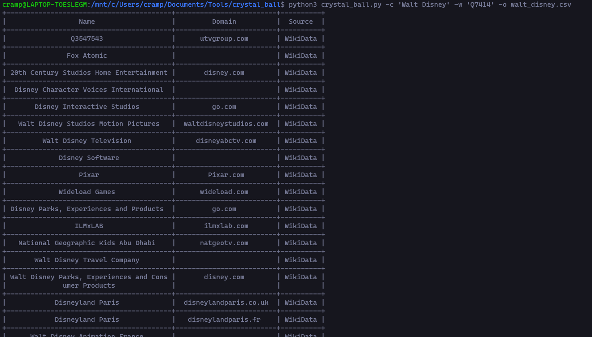

# CRYSTAL BALL

The purpose of this tool is to attempt to perform automated enumeration of an
organization's subsidiaries using freely available information. This tool is
**NOT** meant to provide a comprehensive analysis of subsidiaries but rather
augment a manual analysis to help improve operational efficiency. 

For more information about the methods and theoretical foundation of how this
tool operates check out my blog post on the topic of performing enumeration of
subsidiaries ["The Art of Footprinting - Part I - Finding
subsidiaries":](https://cramppet.github.io/aof_part1/index.html)

## Setup and Configuration

Install the Python dependencies: `pip3 install -r requirements.txt`

You will also need to configure the tool prior to using it. There are several
free API keys which you must obtain. These links will provide you with
sufficient information to perform the setup:

1. [Clearbit API](https://clearbit.com/blog/company-name-to-domain-api/)
2. [Crunchbase Open Data Map (ODM)](https://data.crunchbase.com/docs/open-data-map)
3. [Google Knowledge Graph API](https://developers.google.com/knowledge-graph)

Populate the `config.sample.json` file with the keys and then `mv
config.sample.json config.json` to complete the setup.

## Usage

There are two different tools provided in this repo:

### DNB Extractor

1. The first is an extraction script `scripts/dnb_extractor.py` which processes
   sitemap files from the Dun &amp; Bradstreet website. This information can be 
   used for offline analysis as shown my blog post linked above.

Example usage for this would simply be: `python3 scripts/dnb_extractor.py`. The
process will take quite some time to run, the end result is a data dump totaling
at ~6 GB. The results will be stored in the path `dnb_indexes/` and from there
you can perform offline analysis as needed.

### CRYSTAL BALL

2. The second is the `crystal_ball.py` script which performs the automated
   enumeration of subsidiaries provided with some basic information about the
   company you are trying to target.

You can read the command line help of the tool to see all of the avaliable
options. The most important are shown here:

-   `-c` provides the tool with a canonical name of a company. This name is used
    in SEC filings data and can typically be somewhat loose. It does not have to  
    be a perfect match.

-   `-w` provides the tool with a WikiData identifier which allows for the
    enumeration of subsidiaries using the WikiData knowledge graph. I'd strongly
    recommend using this option in addition to `-c`.

-   `-i` provides a supplemental input list of canonical subsidiary names which
    were acquired externally from this tool. These names will be used in an
    attempt to try and resolve the canonical names in domain names for the
    subsidiary organizations.

An example usage on the Walt Disney company would look like:

